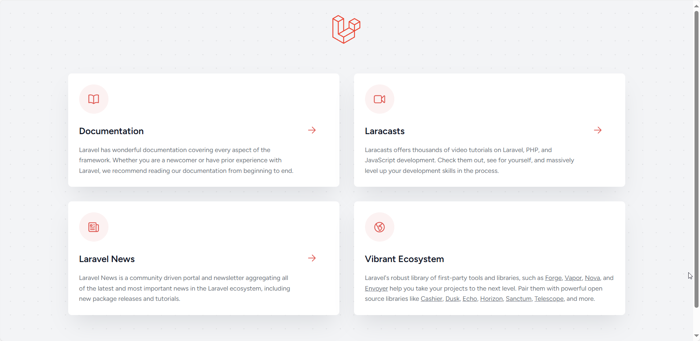
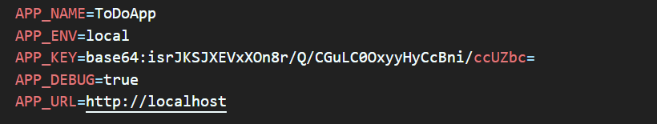
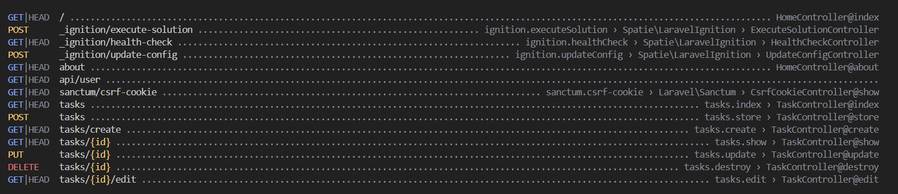

# Лабораторная работа №2. HTTP-запросы и шаблонизация в Laravel

## Цель работы

Изучить основные принципы работы с HTTP-запросами в Laravel и шаблонизацию с использованием Blade на основе веб-приложения To-Do App для команд — приложения для управления задачами внутри команды.

Приложение предназначено для команды, которая хочет управлять своими задачами, назначать их участникам, отслеживать статус и приоритет задач (похоже на Github Issues).

# Условие
## №1. Подготовка к работе, установка Laravel
Откройте терминал и создайте новый проект Laravel с именем todo-app (имя проекта может быть любым) с помощью Composer: bash composer create-project laravel/laravel:^10 todo-app
Перейдите в директорию проекта: bash cd todo-app
Запустите встроенный сервер Laravel: bash php artisan serve Вопрос: Что вы видите в браузере, открыв страницу http://localhost:8000?

В браузере отобразилась стартовая страница Laravel.



## №2. Настройка окружения
Откройте файл .env и укажите следующие настройки приложения: ini APP_NAME=ToDoApp APP_ENV=local APP_KEY= APP_DEBUG=true APP_URL=http://localhost:8000
Сгенерируйте ключ приложения, который будет использоваться для шифрования данных: bash php artisan key:generate Вопрос: Что будет, если данный ключ попадет в руки злоумышленника?

Если данный ключ попадет в руки злоумышленника, он сможет расшифровать конфиденциальные данные и подделывать информацию в системе.



## №3. Основы работы с HTTP-запросами

### №3.1. Создание маршрутов для главной страницы и страницы "О нас"

1. Создайте класс-контроллер HomeController для обработки запросов на главную страницу.
2. Добавьте метод index в HomeController, который будет отвечать за отображение главной страницы.
3. Создайте маршрут для главной страницы в файле routes/web.php. php public function index() { return view('home'); }
4. Откройте браузер и перейдите по адресу http://localhost:8000. Убедитесь, что загружается пустая страница, так как представление home.blade.php пока не создано.
5. В этом же контроллере HomeController создайте метод для страницы "О нас".
6. Добавьте маршрут для страницы "О нас" в файле routes/web.php.

### №3.2. Создание маршрутов для задач
Создайте класс-контроллер TaskController для обработки запросов, связанных с задачами, и добавьте следующие методы:

index — отображение списка задач;
create — отображение формы создания задачи;
store — сохранение новой задачи;
show — отображение задачи;
edit — отображение формы редактирования задачи;
update — обновление задачи;
destroy — удаление задачи.
Примечание: Пока мы не изучили работу с формами и запросами POST и PUT, методы store, create, edit, update, destroy оставьте пустыми. Мы вернемся к ним позже в курсе. В данный момент сосредоточимся на отображении информации.

Пример метода index:

public function index()
{
   return 'This is a list of tasks';
}
Создайте маршруты для методов контроллера TaskController в файле routes/web.php и укажите правильные HTTP-методы для каждого маршрута.

Используйте группирование маршрутов для контроллера TaskController с префиксом /tasks, чтобы упростить маршрутизацию и улучшить читаемость кода.
Определите правильные имена маршрутов для методов контроллера TaskController, например:
tasks.index — список задач;
tasks.show — отображение отдельной задачи.
...
Добавьте валидацию параметров маршрута id для задач. Убедитесь, что параметр id — это положительное целое число. Используйте метод where, чтобы ограничить значения для параметра id.
Вместо ручного создания маршрутов для каждого метода можно использовать ресурсный контроллер, который автоматически создаст маршруты для всех CRUD-операций:
В файле routes/web.php замените ручное создание маршрутов для контроллера TaskController на ресурсный контроллер: php Route::resource('tasks', TaskController::class);

Вопрос: Объясните разницу между ручным созданием маршрутов и использованием ресурсного контроллера. Какие маршруты и имена маршрутов будут созданы автоматически?

Ручное создание маршрутов дает больше контроля над каждым маршрутом, но требует больше кода, в то время как ресурсный контроллер автоматически создает маршруты для стандартных операций, что экономит время и упрощает код, но может понадобиться доработка для особых случаев.

Проверьте созданные маршруты с помощью команды php artisan route:list.




## №4. Шаблонизация с использованием Blade
### №4.1. Создание макета страницы
Создайте макет основных страниц layouts/app.blade.php с общими элементами страницы:
* Заголовок страницы;
* Меню навигации;
* Контент страницы.
Используйте директиву @yield для определения области, в которую будут вставляться содержимое различных страниц.

### №4.2. Использование шаблонов Blade
Создайте представление для главной страницы `home.blade.php` с использованием макета `layouts/app.blade.php` в каталоге `resources/views`.
На главной странице должно быть:
Приветственное сообщение: заголовок и краткое описание приложения, например "To-Do App для команд".
Навигация: ссылки на основные разделы, такие как:
Список задач;
Создание задачи.
Информация о приложении: краткое описание назначения приложения и его основных функций.
Создайте представление для страницы "О нас" — about.blade.php с использованием макета layouts/app.blade.php в каталоге resources/views.
Создайте представления для задач со следующими шаблонами в каталоге resources/views/tasks:
index.blade.php — список задач;
show.blade.php — отображение задачи;
...
Отрендерите список задач на странице index.blade.php с использованием статических данных, передаваемых из контроллера с помощью директивы @foreach.
Примечание: Поскольку мы пока не работаем с базой данных и моделями, используйте статические данные, передаваемые из контроллера в шаблон, для отображения информации о задачах. Логика обработки данных пока не требуется.

Пример метода для отображения задачи:
```php
public function show($id)
{
    $task = [
        'id' => $id,
        'title' => 'Task Title',
        // ...
    ];

    return view('tasks.show', ['task' => $task]);
}
```

### №4.3. Анонимные компоненты Blade

1. Создайте анонимный компонент для отображения header. Используйте созданный компонент в макете layouts/app.blade.php.
2. Создайте анонимный компонент для отображения задачи:
    1. Компонент должен быть простым и использовать передаваемые параметры с помощью директивы @props. Это сделает шаблоны более гибкими и переиспользуемыми на различных страницах.
    2. Компонент должен отображать информацию о задаче:
        * Название задачи;
        * Описание задачи;
        * Дата создания задачи;
        * Дата обновления задачи;
        * Действия над задачей (редактирование, удаление);
        * Статус задачи (выполнена/не выполнена);
        * Приоритет задачи (низкий/средний/высокий);
        * Исполнитель задачи (Assignment), то есть имя пользователя, которому назначена задача.*
3. Отобразите созданный компонент задачи на странице show.blade.php с использованием передаваемых параметров.

### №4.4. Стилизация страниц
Добавьте стили для страниц с использованием CSS или препроцессоров (например, Sass или Less).
Создайте файл стилей app.css в каталоге public/css и подключите его к макету layouts/app.blade.php.
Добавьте стили для элементов страницы, таких как заголовки, меню навигации, кнопки, формы и т. д.
При желании можно использовать библиотеки стилей, такие как Bootstrap или Tailwind CSS.